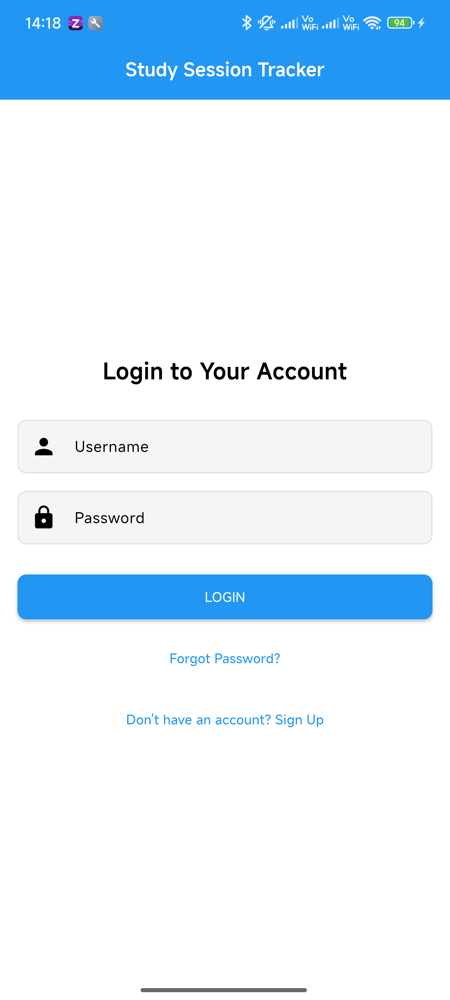

# Study Session Tracker

A Flutter mobile application for students to track and manage their study sessions. Built with Flutter and Back4App (Parse Server) backend.

## Features

- **User Authentication**: Secure signup, login, and password reset functionality
- **Study Session Management**: Create, view, edit, and delete study sessions
- **Notes Support**: Add detailed notes to each study session
- **Study Statistics**: View comprehensive study analytics including:
  - Time spent per subject
  - Study patterns by day of the week
  - Current study streak tracking
- **Search Functionality**: Filter sessions by subject
- **Dark Mode Support**: Toggle between light and dark themes
- **Responsive UI**: Clean, intuitive interface with visual feedback

## Getting Started

### Prerequisites

- Flutter (2.0 or higher)
- Dart (2.12 or higher)
- Android Studio or VS Code with Flutter extensions
- An emulator or physical device for testing

### Installation

1. Clone this repository:

    ```console
    git clone https://github.com/Bhagavan-K/my_study_session_tracker.git
    ```
2. Navigate to the project directory:

    ```console
    cd study-session-tracker
    ```

3. Install dependencies:

    ```console
    flutter pub get
    ```

4. Run the app:

    ```console
    flutter run
    ```


### Check Flutter Setup

To verify your Flutter installation:

    ```console
    flutter doctor
    ```

To list connected devices:

    ```console
    flutter devices
    ```

## Project Structure

- `lib/models/`: Data models (StudySession)
- `lib/screens/`: UI screens (Home, Login, Signup, Profile, Statistics)
- `lib/services/`: Backend services (Back4App integration)
- `lib/widgets/`: Reusable UI components
- `lib/theme_provider.dart`: Theme management

## Future Enhancements

Some potential future improvements for this application:

1. **Study Timer**: Built-in countdown timer for timed study sessions
2. **Study Goals**: Set daily/weekly study goals with progress tracking
3. **Subject Categories**: Organize subjects into categories
4. **Notifications**: Reminders to maintain study streaks
5. **Data Export**: Export study data as CSV for external analysis
6. **Study Insights**: Advanced analytics with personalized study recommendations
7. **Multi-platform Support**: Web and desktop versions

## Screenshots




## Contact

[**Bhagavan K**] - [radhakrishna.kbns@gmail.com]

**Project Link:** [https://github.com/Bhagavan-K/my_study_session_tracker](https://github.com/Bhagavan-K/my_study_session_tracker)